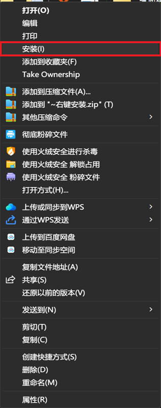
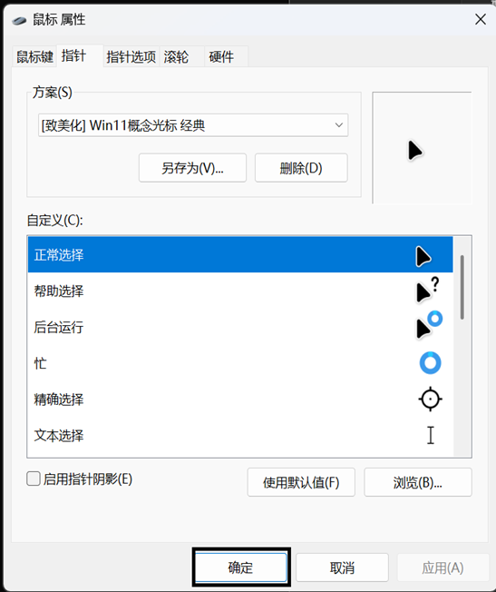
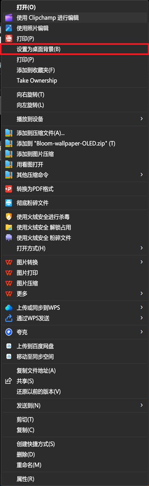

如何让win11变得更好看

一、  准备工作：

\1.  一台Win11电脑

\2.  Win11概念版鼠标指针

\3.  Win11 Copilot壁纸

二、  鼠标指针替换为Win11概念版鼠标指针

\1.  右键“~右键安装.inf”或“~右键安装”点击安装，如果没有此选项，可以点击显示更多选项

-----------------------------------------------------------分段线------------------------------------------------------------

\2.  然后点击确定

三、  桌面背景切换

右键图片点击设为桌面背景

图片请看下一页

